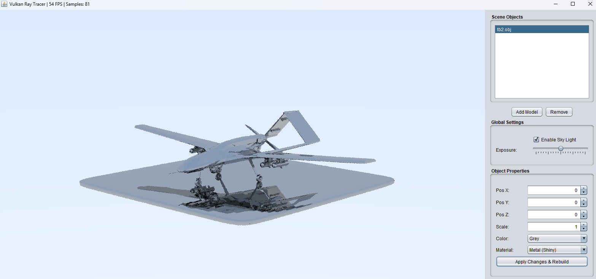
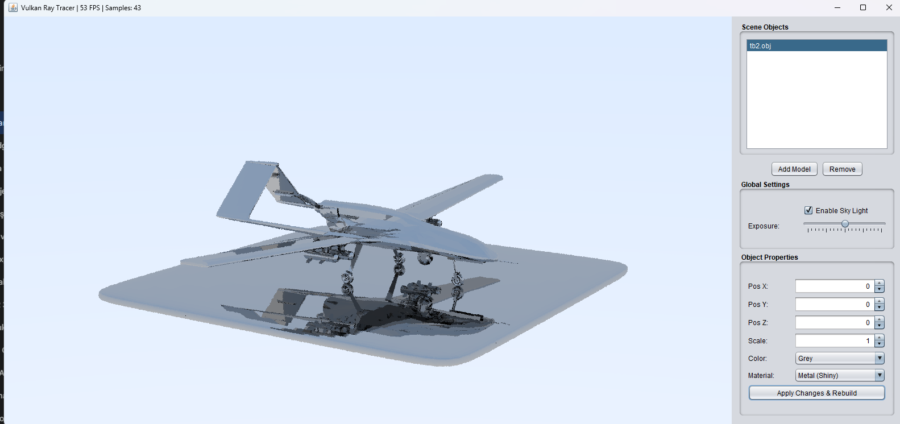
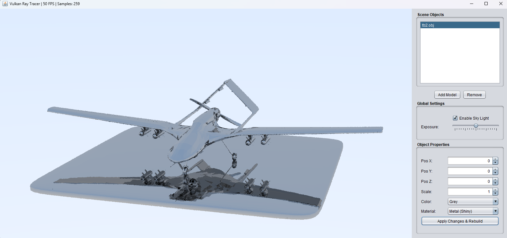
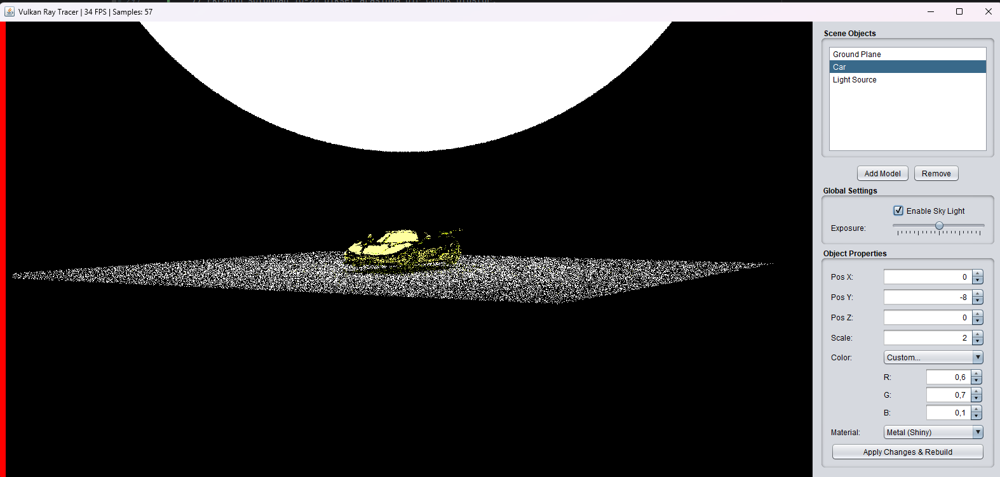
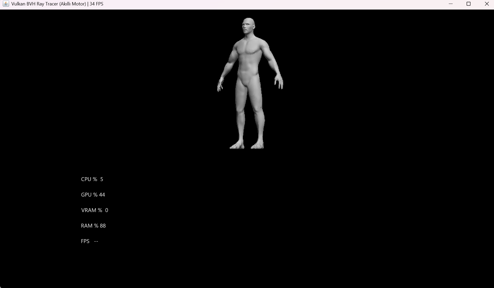
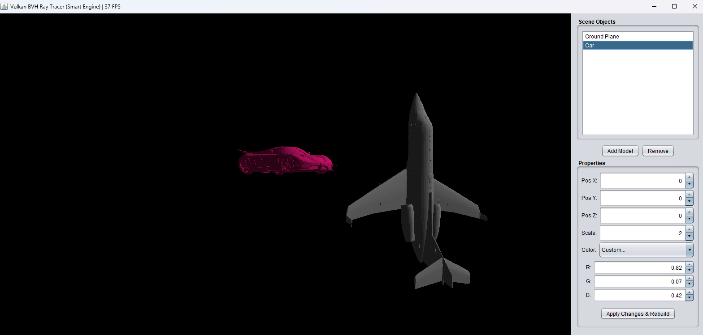

# Project Render Showcase

This document displays the render outputs and scene tests generated by the Ray Tracer engine developed within this project.

Return to main documentation: [README.md](./README.md)

---

### TB2 Model Renders

<table>
  <tr>
    <td align="center">
      
       
    </td>
    <td align="center">
      
       
    </td>
    <td align="center">
      
       
    </td>
  </tr>
</table>

---

## Character and Scene Tests
Complex geometry and shading experiments.

<table>
  <tr>
    <td align="center">
      
       
      Two Humans Scene
    </td>
    <td align="center">
      
       
      Car & Human Scale Test
    </td>
  </tr>
</table>

---

## Development Stages (Work in Progress)
Renders from early development or testing phases.

  
Click to view pre-step images (Early Engine Tests)

   

  <table>
    <tr>
      <td align="center">
        
         
        Initial Sphere Test
      </td>
        <td align="center">
        
         
        Step 4.5: Material Test
      </td>
      <td align="center">
        
         
        Car & Light Source
      </td>
    </tr>
    <tr>
      <td align="center">
        
         
        Step 5: BVH CPU Build
      </td>
      <td align="center">
        
         
        Human Mesh (No RTX)
      </td>
      <td align="center">
        
         
        Car & Plane (No RTX)
      </td>
    </tr>
    <tr>
      <td align="center" colspan="3">
        
         
        Car Model
      </td>
    </tr>
  </table>

---

### Technical Notes
* All images were generated using the custom Vulkan Ray Tracing infrastructure.
* Video demonstrations can be found in the `render-video` directory.