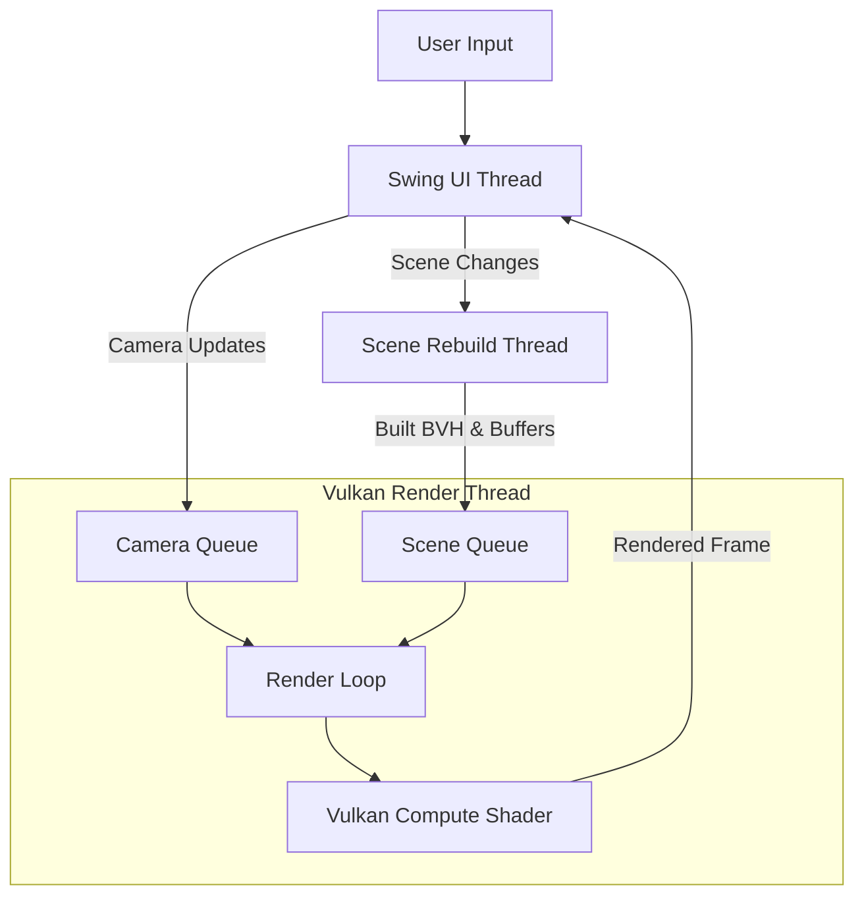

# Gpu Based 3D Ray Tracer 


**Author:** Demir Demirdöğen

> **Work in Progress:** This project is actively under development. Features, render techniques, and UI elements are subject to change as new capabilities (like Path Tracing) are implemented.

A high-performance, real-time **GPU Ray Tracer** written in Java using **LWJGL** and **Vulkan**.

This project, developed as a **Software Engineering Student Project**, demonstrates a robust, multi-threaded architecture capable of rendering complex 3D scenes. It utilizes a custom CPU-built **Bounding Volume Hierarchy (BVH)** to achieve O(log n) ray intersection on the GPU, allowing for real-time performance even on integrated graphics.


##  Key Features

* **Real-Time GPU Rendering:** Uses Vulkan Compute Shaders (`.comp`) for massive parallel ray tracing.
* **BVH Acceleration:** Implements a Linear BVH structure built on the CPU and flattened for GPU traversal, allowing rendering of meshes with 50k+ triangles efficiently.
* **Multi-Threaded Architecture:**
    * **UI Thread:** Responsive Swing Interface (never freezes).
    * **Vulkan Render Thread (VRT):** Dedicated rendering loop managing command queues.
    * **Scene Rebuild Thread (SRT):** Asynchronous BVH construction for non-blocking scene editing.
* **Interactive Editor:**
    * Add/Remove `.obj` models dynamically.
    * Modify object **Position**, **Scale**, and **Color** in real-time.
    * Change Material properties (**Matte**, **Metal**, **Emissive**).
* **Dynamic Camera:** Smooth WASD controls with Uniform Buffer Object (UBO) updates.

##  System & Performance

This engine is highly optimized to run efficiently without requiring high-end dedicated hardware.

**Tested System Specs:**
* **OS:** Windows 11 Home Single Language 64-bit
* **CPU:** 13th Gen Intel(R) Core(TM) i9-13900H
* **GPU:** Intel(R) Iris(R) Xe Graphics (Integrated)
* **RAM:** 16GB

> **Performance Note:** Despite running on an integrated GPU (no external graphics card), the application maintains a stable **~40 FPS** in complex scenes. This demonstrates the efficiency of the BVH acceleration structure and memory management.

##  Architecture Overview

The application is built on a "Decoupled Rendering" model to ensure the UI remains responsive even during heavy computation like BVH construction.



##  Controls

### Camera Movement
* **W / S:** Move Forward / Backward
* **A / D:** Move Left / Right
* **Q / E:** Move Up / Down

### UI Panel
* **Object List:** Select objects to modify properties.
* **Add Model:** Import standard `.obj` files from disk.
* **Global Settings:** Toggle Sky Light, Adjust Exposure.
* **Material Editor:** Switch between Lambertian, Metallic, or Emissive materials.

##  Technical Details

* **Language:** Java 17+
* **Graphics API:** Vulkan 1.2+ (via LWJGL 3)
* **Shading Language:** GLSL 4.50
* **Acceleration Structure:** Linear Bounding Volume Hierarchy (LBVH) built on CPU.
* **Synchronization:** Explicit memory barriers and layout transitions (General <-> Transfer) to manage resource synchronization between Compute and Transfer queues.

##  Build & Run

### Prerequisites
* **Java:** JDK 17 or higher.
* **Vulkan:** A Vulkan-capable GPU and the **Vulkan Runtime/SDK** installed on your system.
* **Build Tool:** Maven or Gradle (depending on project setup).

### Running
1.  Clone the repository.
2.  Ensure shader binaries (`.spv`) are compiled in `shaders_spv/`.
3.  Run the main class:
    ```bash
    # Run via IDE or Jar
    java -jar target/ray-tracer-vulkan.jar
    ```

## 📄 Development Log

For a detailed history of the project's evolution, technical hurdles, and future roadmap (Path Tracing implementation), please see the [DEVELOPMENT_LOG.md](DEVELOPMENT_LOG.md).

*Powered by LWJGL and Vulkan.*

